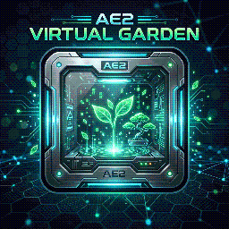

# AE2 Virtual Garden

<div align="center">
  

  **Virtual Botany inside your ME Network for Minecraft 1.21.1 (NeoForge)**

  [](https://minecraft.net/)
  [](https://neoforged.net/)
  [](https://appliedenergistics.org/)
  [](LICENSE)
</div>

---

## 🌿 About

**AE2 Virtual Garden** is an official-style addon for **Applied Energistics 2** on **Minecraft 1.21.1 (NeoForge)**. It bridges digital ME network storage and automated botany by introducing generative **Virtual Garden Storage Cells**.

Insert a configured Garden Cell into any standard **ME Drive** or **ME Chest**, supply AE power, and watch it generate real plant crops, wood logs, saplings, apples, seeds, and botany drops directly into the cell every 3 seconds (60 ticks)!

---

## ✨ Features

- 📦 **5 Tiers of Virtual Garden Cells:** 1k, 4k, 16k, 64k, and 256k storage cells.
- ⚡ **Scaled Production Rates:** Drops per cycle scale with cell tier (1 up to 256 drops every 3 seconds).
- 🛑 **Zero Network Flooding & Smart Auto-Stop:**
  - Drops are generated **strictly** into the garden cell itself.
  - When the cell reaches full capacity (`CellState.FULL` or byte/type limits), production completely halts.
  - No drops ever spill over into other cells in your ME network!
- 🔋 **Zero Power Waste on Overflow:** When a cell is full, zero AE power is drained for unproduced drops.
- 🌲 **12 Vanilla Trees & 17 Crops Out of the Box:** Full drop tables for all oak, birch, spruce, jungle, dark oak, acacia, mangrove, cherry, bamboo, crimson/warped fungus, chorus, wheat, carrots, potatoes, melon, pumpkin, nether wart, sugar cane, cactus, kelp, berries, mushrooms, and more!
- 🔍 **Automated Modded Crop & Sapling Discovery:** Automatically detects any modded `CropBlock` (e.g., Farmer's Delight, Mystical Agriculture) and saplings, discovering their harvest drops and corresponding wood logs/stems without requiring manual configuration.
- 📋 **Datapack Extensible:** Create or customize drop recipes via standard JSON datapacks using recipe type `ae2virtualgarden:garden_drop`.
- 🛠️ **Two Configuration Methods:**
  - **Cell Workbench (AE2 native):** Put the cell in a Cell Workbench and configure the filter slot with your seed or sapling.
  - **In-Hand Quick Config:** Hold the cell in your main hand and a seed/sapling in your offhand, then **Sneak + Right-Click** to configure instantly! (Sneak + Right-Click with empty offhand resets the cell).
- 📊 **Native AE2 Tooltips:** Displays byte and type usage with color coding (Green → Orange → Red), upgrade cards, and visual item preview icons with amounts.

---

## 📊 Cell Tiers & Rates

By default, drop cycles occur every **60 ticks (3.0 seconds)**:

| Tier | Capacity | Drop Yield | Generation Rate | Idle Power Drain |
| :--- | :--- | :--- | :--- | :--- |
| **1k Virtual Garden Cell** | 1,024 Bytes | **1 Drop** | 1 drop / 3.0s | 0.5 AE/t |
| **4k Virtual Garden Cell** | 4,096 Bytes | **4 Drops** | 4 drops / 3.0s | 1.0 AE/t |
| **16k Virtual Garden Cell** | 16,384 Bytes | **16 Drops** | 16 drops / 3.0s | 2.0 AE/t |
| **64k Virtual Garden Cell** | 65,536 Bytes | **64 Drops** | 64 drops / 3.0s | 4.0 AE/t |
| **256k Virtual Garden Cell** | 262,144 Bytes | **256 Drops** | 256 drops / 3.0s | 8.0 AE/t |

*All drop counts, tick intervals, and AE energy costs (default: 10.0 AE per drop) are fully customizable in `config/ae2virtualgarden-common.toml`.*

---

## 🔨 Crafting Recipes

### 1. Garden Cell Housing
```
[ Quartz Glass ] [ Certus Quartz ] [ Quartz Glass ]
[ Redstone     ] [ Iron Ingot   ] [ Redstone     ]
[ Iron Ingot   ] [ Iron Ingot   ] [ Iron Ingot   ]
```

### 2. 1k Garden Cell Component
```
[ Redstone    ] [ Bone Meal            ] [ Redstone    ]
[ Bone Meal   ] [ 1k ME Storage Component ] [ Bone Meal   ]
[ Redstone    ] [ Bone Meal            ] [ Redstone    ]
```

### 3. Higher Tier Components (4k, 16k, 64k, 256k)
Crafted following AE2's tier upgrade progression:
- Combine 3x previous tier Garden Cell Components + 1x AE2 Calculation Processor + Quartz Glass.

### 4. Complete Storage Cells
Shapeless recipe: Combine a **Garden Cell Housing** with any **Garden Cell Component**.

---

## ⚙️ Configuration

The configuration file is located at `config/ae2virtualgarden-common.toml`:

```toml
[general]
  # Base interval in ticks between virtual garden drop cycles (20 ticks = 1 second)
  # Range: 1 ~ 72000 (Default: 60)
  baseTickInterval = 60

  # Whether virtual garden cells require AE energy from the network to produce drops
  # Default: true
  requireAeEnergy = true

  # AE energy consumed per drop produced
  # Range: 0.0 ~ 100000.0 (Default: 10.0)
  energyPerDrop = 10.0

[drop_rates]
  # Drops produced per cycle by 1k Cell (Default: 1)
  tier1kDrops = 1
  # Drops produced per cycle by 4k Cell (Default: 4)
  tier4kDrops = 4
  # Drops produced per cycle by 16k Cell (Default: 16)
  tier16kDrops = 16
  # Drops produced per cycle by 64k Cell (Default: 64)
  tier64kDrops = 64
  # Drops produced per cycle by 256k Cell (Default: 256)
  tier256kDrops = 256
```

---

## 📜 Custom Datapack Drops

You can add custom drops or override existing drop tables using datapack JSON files in `data/<namespace>/recipe/<name>.json`:

```json
{
  "type": "ae2virtualgarden:garden_drop",
  "seed": "minecraft:wheat_seeds",
  "drops": [
    {
      "item": "minecraft:wheat",
      "weight": 65,
      "min": 1,
      "max": 1
    },
    {
      "item": "minecraft:wheat_seeds",
      "weight": 35,
      "min": 1,
      "max": 2
    }
  ]
}
```

---

## 📦 Requirements

- **Minecraft:** `1.21.1`
- **NeoForge:** `21.1.172+`
- **Applied Energistics 2:** `19.2.10+`

---

## 🛠️ Building From Source

1. Clone repository:
   ```bash
   git clone https://github.com/your-username/AE2VirtualGarden.git
   cd AE2VirtualGarden
   ```
2. Build with Gradle:
   ```bash
   ./gradlew build
   ```
3. The built JAR file will be located in `build/libs/ae2virtualgarden-1.0.0.jar`.

---

## 📄 License

This project is licensed under the **MIT License**. Feel free to use this mod in any modpack!
